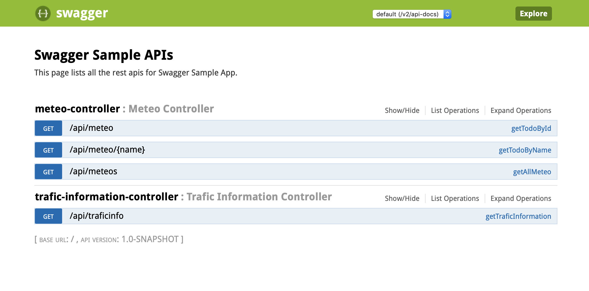
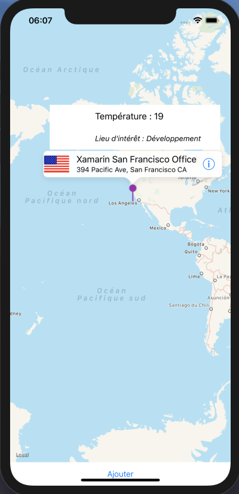

# Defi "Open Data" Nuit de l'info

But du défi, utiliser le maximum d'API présentant des "open data".

## Developpé par l'équipe 404 Not Found

1. Aurelien Pietrzak
2. Aymeric Vanderkelen
3. Ghislain Deschamps
4. Adrien Jablonski
5. Hollertt Marceau
6. Jourdain Nicolas

## Presentation du projet

Le projet est developpé en Java à l'aide du framework **SpringBoot** developpé par Pivotal

**Pourquoi Springboot ?**

SpringBoot est un framework qui a la particularité d'embarquer en plus de l'application Java un serveur d'application **Jboss**. Il permet nottament de déployer l'application sur tout type de machine à condition que celle ci possède **Java**, couplé à **Maven** un gestionnaire de dépendance il n'est pas nécessaire d'installer toutes les dépendances sur la machine.

La facilité de Springboot est démontrée avec la commande de lancement

```bash
mvn spring-boot:run      
```

**Ensuite ?**

Une fois notre application lancée il est possible de créer une API Rest afin que celle-ci soit appelée par des contributeurs utilisant n'importe quelle technologie, l'API Rest est couplé à du Json qui permet l'intéropérabilité entre les applications, l'application Springboot permet d'appeler les différentes API qui vont restituer les applications, ce qui facilitera le travail des developpeurs front-ent afin de regrouper les API en une seule API 

**Quelles sont les API qui ont été utilisées ? **

Deux API ont été utlisées dans ce projet

- L’API de *OpenWeatherMap* pour les données Météo

  > <https://openweathermap.org/api>

- L'API de *Here* pour les données trafic routier 

  > https://developer.here.com

L'API *OpenWeatherMap* pouvant présenter un grand nombre de données il a été décidé de mettre en place une base **mongoDB** afin d'éviter les appels vers L'API en question afin d'avoir une application plus réactivite.

La base **mongoDB** a été déployé dans le cloud sur mongolab.

**Quelle est notre API ? **

Maintenant que nous avons pu récupérer toutes les informations, nous devons être en mesure de la présenter à nos éventuels clients, il nous fallait donc l'héberger afin que celle ci soit accessible publiquement, nous avons choisi la solution **Heroku**, **Heroku** est un hébergeur cloud qui a la possibilité de démarrer des applications de divers langages notamment **Java** de manière <u>très simple</u>.

Une fois tous nos travaux terminés l'API est disponible à cette adresse prête à être utilisée par tout le monde, avec n'importe quelle langage.

- Swagger de l'application 

  > https://opendata-nuit.herokuapp.com/swagger-ui.html#


Il est très facile de la tester notamment avec l'outil Postman

Nous avons intégrer notre API à notre Interface Web et Application Mobile, vous pourrez y voir apparaitre des données météo et trafic routier disponible à cette adresse.

- Interface Web

  > <http://nuitinfo.ddns.net/>

- Interface Mobile

  > https://github.com/Yuoox/MaraudeurN2I2018



Merci de votre lecture.

 
